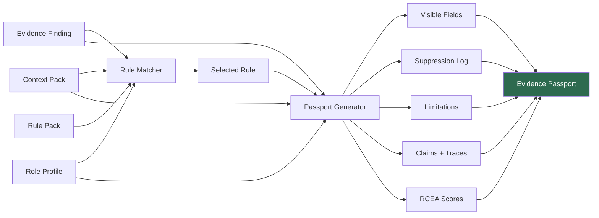

# Figure 1 — RCEA Pipeline

```mermaid
flowchart LR
    F[Evidence Finding] --> M[Rule Matcher]
    C[Context Pack]     --> M
    R[Role Profile]     --> M
    RP[Rule Pack]       --> M
    M  --> RU[Selected Rule]
    RU --> PG[Passport Generator]
    F  --> PG
    C  --> PG
    R  --> PG
    PG --> VF[Visible Fields]
    PG --> SL[Suppression Log]
    PG --> LP[Limitations]
    PG --> CL[Claims + Traces]
    PG --> SC[RCEA Scores]
    VF --> EP[Evidence Passport]
    SL --> EP
    LP --> EP
    CL --> EP
    SC --> EP
    style EP fill:#2d6a4f,color:#fff
```
