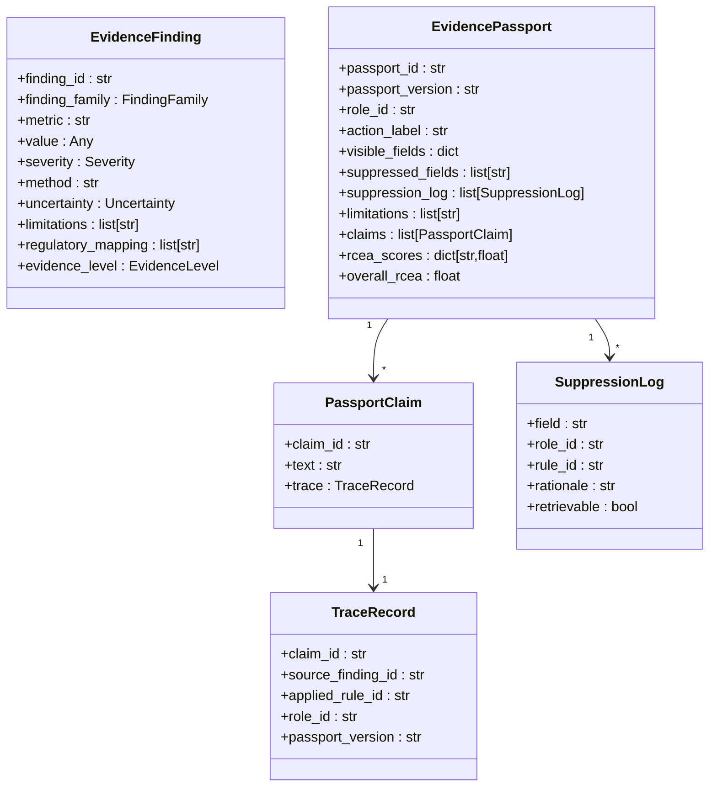

# Figure 2 — Evidence Passport Architecture

```mermaid
classDiagram
    class EvidenceFinding {
        +finding_id : str
        +finding_family : FindingFamily
        +metric : str
        +value : Any
        +severity : Severity
        +method : str
        +uncertainty : Uncertainty
        +limitations : list[str]
        +regulatory_mapping : list[str]
        +evidence_level : EvidenceLevel
    }
    class EvidencePassport {
        +passport_id : str
        +passport_version : str
        +role_id : str
        +action_label : str
        +visible_fields : dict
        +suppressed_fields : list[str]
        +suppression_log : list[SuppressionLog]
        +limitations : list[str]
        +claims : list[PassportClaim]
        +rcea_scores : dict[str,float]
        +overall_rcea : float
    }
    class PassportClaim {
        +claim_id : str
        +text : str
        +trace : TraceRecord
    }
    class TraceRecord {
        +claim_id : str
        +source_finding_id : str
        +applied_rule_id : str
        +role_id : str
        +passport_version : str
    }
    class SuppressionLog {
        +field : str
        +role_id : str
        +rule_id : str
        +rationale : str
        +retrievable : bool
    }
    EvidencePassport "1" --> "*" PassportClaim
    EvidencePassport "1" --> "*" SuppressionLog
    PassportClaim    "1" --> "1" TraceRecord
```
