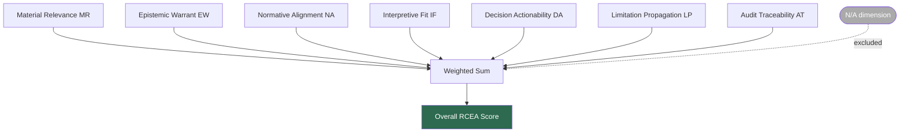

# Figure 3 — RCEA Score Aggregation

```mermaid
flowchart TD
    MR[Material Relevance MR]       --> W[Weighted Sum]
    EW[Epistemic Warrant EW]        --> W
    NA[Normative Alignment NA]      --> W
    IF[Interpretive Fit IF]         --> W
    DA[Decision Actionability DA]   --> W
    LP[Limitation Propagation LP]   --> W
    AT[Audit Traceability AT]       --> W
    W  --> O[Overall RCEA Score]
    N/A([N/A dimension]) -. excluded .-> W
    style O  fill:#2d6a4f,color:#fff
    style N/A fill:#aaa,color:#fff
```

> N/A dimensions are excluded; weights are renormalised over the remaining active set.
