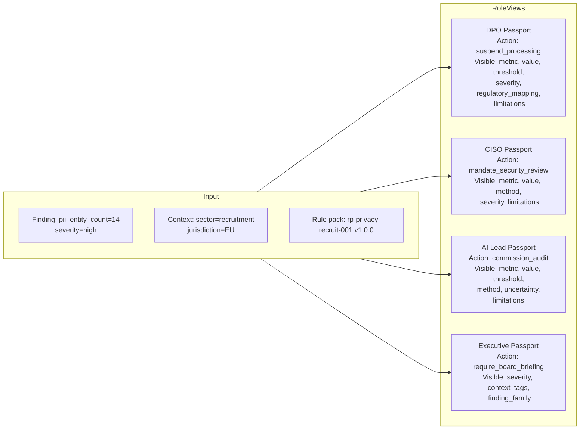

# Figure 4 — Worked Example: Privacy/Recruitment Finding Transformation

```mermaid
flowchart LR
    subgraph Input
        F[Finding: pii_entity_count=14\nseverity=high]
        C[Context: sector=recruitment\njurisdiction=EU]
        RP[Rule pack: rp-privacy-recruit-001 v1.0.0]
    end
    subgraph RoleViews
        DPO[DPO Passport\nAction: suspend_processing\nVisible: metric, value, threshold,\n severity, regulatory_mapping,\n limitations]
        CISO[CISO Passport\nAction: mandate_security_review\nVisible: metric, value, method,\n severity, limitations]
        AIL[AI Lead Passport\nAction: commission_audit\nVisible: metric, value, threshold,\n method, uncertainty, limitations]
        EXEC[Executive Passport\nAction: require_board_briefing\nVisible: severity, context_tags,\n finding_family]
    end
    Input --> DPO
    Input --> CISO
    Input --> AIL
    Input --> EXEC
```
